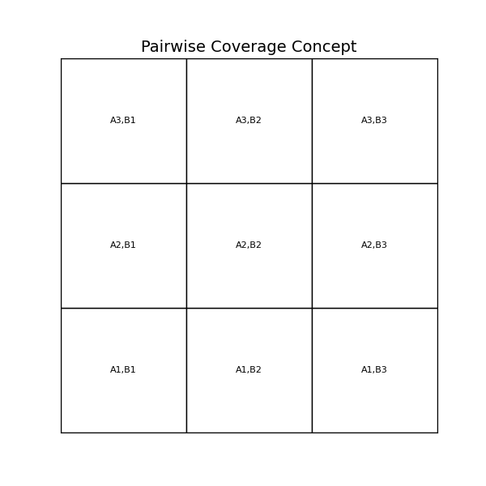

# Pairwise Design of Experiments (DOE): Theory, Algorithm, Math & Practical Guide

## 1. Introduction
Design of Experiments (DOE) explores factor effects systematically. A full factorial design tests every combination:

$$N_{\text{full}} = \prod_{i=1}^k L_i$$

For our case:

$$k = 12, \quad L = [5,5,5,5,4,2,2,3,2,5,7,9]$$

$$N_{\text{full}} = 18{,}900{,}000 \text{ runs}$$


This file explains the pairwise (2-way) DOE approach for dramatically reducing run count while still ensuring coverage of all factor-level pairs, and it covers implementation, verification, and practical tips for tuning and constraints.

## 2. Pairwise Coverage Concept

Instead of all combinations, pairwise DOE ensures every *pair* of factor levels appears at least once in the run matrix. This is equivalent to constructing a 2-way covering array, often denoted CA(N; t=2, k, v).

Key quantities:

- Number of factors k = 12
- Levels per factor L_i (see section 8)
- Pairs to cover: for factor i < j, we need L_i * L_j distinct level-level pairs
- Total number of factor-pairs (combinatorial) per row: C(k,2) = 66

Using L = [5, 5, 5, 5, 4, 2, 2, 3, 2, 5, 7, 9], the total number of required level-level pairs to cover across all factor pairs is:

$$\sum_{i<j} L_i L_j = 1312$$

This means the theoretical lower bound number of runs (if a design could pack coverage perfectly, i.e., each row covers 66 unique uncovered pairs) is:

$$\left\lceil\frac{1312}{66}\right\rceil = 20\text{ runs (lower bound)}$$

Our greedy solver produces ~73 runs in practice, which is still a >250x reduction versus full factorial but not theoretically optimal; this gap is due to practical constraints, random sampling strategies, and the greedy algorithm's limitations.



## 3. Mathematical Basis

For each pair of factors $(F_i, F_j)$:

$$\text{Pairs}_{i,j} = L_i \times L_j$$

Total pairs to cover across all unique factor pairs is:

$$\sum_{i<j} L_i L_j$$

For this workspace example the total is 1312 (computed above), and as noted, the theoretical minimum number of runs required is at least ceil(total_pairs / pairs_per_row) where pairs_per_row = C(k,2).

## 4. Algorithm Flow

Greedy approach (implemented in `generate_pairwise_doe.py`):


Steps overview:

1. Define factors & levels.
2. Generate the set of all level-level pairs to cover (uncovered_pairs).
3. Loop until uncovered_pairs is empty:
   - Randomly sample K candidate rows (value of K is configurable; the provided script uses MAX_TRIES_PER_STEP).
   - For each candidate, compute how many uncovered pairs it would cover.
   - Select the candidate that covers the most uncovered pairs.
   - Add the selected row to the pairwise design and remove any pairs it covers from the uncovered set.
4. Output the design as CSV.

This greedy sampling approach is quick and effective for many practical problems but not guaranteed to find minimal N.

Advantages:

- Simple to implement
- Works well for typical sizes
- Easy to incorporate constraints and custom candidate filters

Tradeoffs:

- Not guaranteed optimal (may produce more runs than minimal)
- Candidate sample size (K) and randomness matter: higher K can lead to better coverage but longer runtime

### 4.1 Detailed Walkthrough & Pseudocode

This section expands the algorithm into practical steps and pseudocode so you can see practical variants and how the implementation in `generate_pairwise_doe.py` follows them.

Pseudocode (reference implementation):

```python
def generate_pairwise_doe(factors, is_valid=None, seed=42, max_tries=400):
    random.seed(seed)
    factor_names, levels = extract(factors)
    k = len(factor_names)
    pair_indices = [(i, j) for i in range(k) for j in range(i+1, k)]
    uncovered = set((i, a, j, b) for i, j in pair_indices for a in levels[i] for b in levels[j])
    design = []
    while uncovered:
        best = None
        best_cov = 0
        # Sample some diverse candidates
        for _ in range(max_tries):
            candidate = [random.choice(levels[i]) for i in range(k)]
            if is_valid and not is_valid(candidate):
                continue
            cov, to_remove = count_uncovered_pairs(candidate, uncovered)
            if cov > best_cov:
                best, best_cov, best_remove = candidate, cov, to_remove
        if best is None:
            # fallback strategy: pick a pair still uncovered and create a row that includes it
            best = construct_row_for_uncovered_pair(uncovered, levels, is_valid)
            best_cov, best_remove = count_uncovered_pairs(best, uncovered)
        design.append(best)
        for r in best_remove:
            uncovered.discard(r)
    return design
```

Notes on fallback strategy: if sampling doesn't find a valid candidate that covers anything (rare mid/late phase), derive a candidate deterministically by selecting one uncovered pair (i, a, j, b) and populating other factors with random or common levels.

### 4.2 Complexity & Data Structures

- Variables:

    - k = number of factors (12)
    - P = number of pairs to cover (~1312)
    - N = final runs in DOE (≈73 for greedy)
    - K = MAX_TRIES_PER_STEP (400 by default)

- Time complexity estimate (rough): `O(N * K * k^2)`. The `k^2` arises from checking all factor pairs for each candidate. For our parameter sizes, runtime is dominated by the number of candidates sampled and the check for uncovered pairs.

Data structure optimizations:

- Use integer encoding for levels and precompute pair-index to quickly check membership in `uncovered` (use Python's set with integer tuples or use numpy/bitsets for faster vectorized operations).
- Maintain a `pair_to_candidates` map when creating/constructing candidates from known pairs — this reduces repeated scanning.
- Use bit arrays or `int` bitfields to represent coverage state. Bit operations are much faster than many set operations for dense-ish pair space.

#### Bitset / Integer mask example

Mapping each pair to an integer index allows fast coverage checks via integer bit masks. For ~1300 pairs, Python integer bit operations are still very fast:

```python
# Build pair -> index map
pair_index = {pair: idx for idx, pair in enumerate(sorted(all_pairs))}
total_pairs = len(pair_index)
uncovered_mask = (1 << total_pairs) - 1

def row_mask(row, pair_index, pair_indices):
    m = 0
    for (i, j) in pair_indices:
        p = (i, str(row[i]), j, str(row[j]))
        idx = pair_index.get(p)
        if idx is not None:
            m |= (1 << idx)
    return m

# Then check coverage with bit ops:
# if row_mask(candidate) & uncovered_mask > 0 --> candidate covers some uncovered pairs
```

### 4.3 Performance Optimizations & Heuristics

- Candidate generation

- Heuristics: sample candidates that prioritize covering the rarest pairs (compute pair occurrence probability and bias sampling), or mutate rows that already cover many pairs.
- Seeded rows: start with rows that cover many pairs (like a default or typical level combinations) to get a head start.

- Rare pair prioritization (example)

    - Compute pair frequencies from the domain (or during sampling), then when generating candidates sample levels that include less-covered pairs more often.

- Post-process compression: once you have a design, try removing rows that are redundant:

    - For each row, attempt to remove it and verify coverage remains complete; if so, remove it permanently (iterated until no more removable rows).

- Parallelizing candidate evaluation

    - Candidate sampling and coverage counting are embarrassingly parallel; use multiprocessing or joblib to evaluate many candidates per step concurrently.
    Example (concurrent futures):

    ```python
    from concurrent.futures import ThreadPoolExecutor
    def evaluate_candidate(c):
        return count_uncovered_pairs(c, uncovered)
    with ThreadPoolExecutor(max_workers=8) as ex:
        results = list(ex.map(evaluate_candidate, candidates))
    ```

- Handling constraints
    - Precompute and remove infeasible pairs from `uncovered` if those combinations cannot be formed.
    - Use is_valid() checks while sampling and skip invalid candidates.

### 4.4 Practical Walkthrough (example)

Suppose uncovered has 4 remaining pairs for pair-index (0, 11) (e.g., levels A, B, C, D). If you randomly generate a candidate that includes A and C for those two factors, it will remove those two pairs. The greedy algorithm will prefer candidates that remove more such pairs.

In practice, you will see the number of uncovered pairs drop quickly in the first few dozen rows, and then slower as the algorithm covers rarer pair combinations.

### 4.5 Benchmarking & Metrics

Collect the following metrics when evaluating algorithm performance:

- N (final number of runs)
- wallclock runtime
- CPU usage (for parallel runs)
- Candidate evaluations performed
- Pair coverage progression (plot #pairs remaining vs rows selected)

Use the following pattern to run and log metrics:

```python
import time
start = time.perf_counter()
doe = generate_pairwise_doe(factors, max_tries=1000)
end = time.perf_counter()
print(f"N rows: {len(doe)}, runtime: {end-start:.2f}s")
```

## 5. Result

Full factorial: $$\approx 18.9 \text{ million runs}$$
Pairwise DOE (greedy script): $$\approx 73 \text{ runs}$$

Reduction:

$$\text{Reduction} = \frac{18{,}900{,}000}{73} \approx 258{,}904$$

Notes on runs generated:

- The sample run uses a seed and parameters (MAX_TRIES_PER_STEP=400, MAX_STEPS=5000) and yields ≈73 runs.
- Smaller MAX_TRIES_PER_STEP can produce more runs; increasing it (e.g., 2000–5000) will try more candidates at each step and can produce smaller designs at the cost of longer run-time.

## 6. Practical Notes

- Covering all two-factor interactions (2-way) is often a strong compromise between breadth and practicality; many real-world issues are due to pairwise factor interactions.
- Pairwise DOE DOES NOT guarantee higher-order coverage; if clear 3-way or higher interactions exist, consider 3-way or higher t-way covering arrays.
- Use constraints to filter infeasible or unrealistic combos (see section 9).
- Reproducibility: seed the RNG (e.g., `random.seed(42)`) for deterministic outputs.
- Validation: always verify produced CSV actually covers all pairs (see section 10).

## 7. Implementation Details and Tuning

- Script: `generate_pairwise_doe.py` demonstrates the greedy sampling algorithm.
- Tuning parameters in the script:
   - `MAX_TRIES_PER_STEP`: Number of random candidates evaluated per greedy step (default 400). Raising it increases the chance of selecting better rows but increases run-time.
   - `MAX_STEPS`: Safety limit for the greedy loop to prevent infinite loops (default 5000).
   - RNG seed: set for reproducibility (default `random.seed(42)`).

- Complexity: each greedy step samples `MAX_TRIES_PER_STEP` candidates and evaluates their coverage across C(k,2) pairs. Worst-case runtime grows with number of pairs and sample size.

Tips:

- If you have computational resources, increase `MAX_TRIES_PER_STEP` to find better candidates.
- If runtime is an issue, use fewer candidates but expect larger designs.
- Monitor `uncovered_pairs` to see how coverage improves; it usually decays quickly then slows as remaining rare pairs are harder to cover.

## 8. Factors & Levels (Run Matrix)

The workspace example uses 12 factors with the following levels:

| Factor | Levels (count) |
|---|---:|
| Input Rate | 5 |
| Gas Valve Location | 5 |
| Gas Valve Differential | 5 |
| Dip Tube Length | 5 |
| Tank Volume | 4 |
| Flue Tube | 2 |
| Tank Diameter | 2 |
| Jacket Thickness | 3 |
| Damper | 2 |
| Water Outlet | 5 |
| Water Inlet | 7 |
| Foam R-Value | 9 |

We computed earlier the total pairs as 1,312 and full factorial as 18.9 million rows.

## 9. Handling Constraints (Infeasible Combos)

In real systems, not all combinations are feasible (e.g., specific inlets with particular outlets may be invalid). To handle constraints:

1. Represent constraints as boolean filters. Example:

```python
def is_valid(row):
    # row is a list in the order of factor_names
    # Example constraint: If Tank Volume is 36g, then Water Outlet cannot be 125.
    if row[factor_indices['Tank Volume']] == '36g' and row[factor_indices['Water Outlet']] == 125:
        return False
    return True
```

2. During candidate sampling, discard invalid candidates and keep sampling until a valid candidate is found or a timeout occurs.
3. You may also pre-compute and exclude invalid pairs from `uncovered_pairs` if a particular level-level pair is infeasible.

Important: Filtering candidates can reduce the algorithm's ability to minimize the number of runs since some pairs will be harder to combine in the same row.

## 10. Verifying Pairwise Coverage

After the script generates `Pairwise_DOE.csv`, always verify that every pair is covered. Here's a quick check script:

```python
import pandas as pd
from itertools import combinations

df = pd.read_csv('Pairwise_DOE.csv')
factor_names = df.columns.tolist()
levels_by_factor = {i: df[factor].unique().tolist() for i, factor in enumerate(factor_names)}

# Create the full target set of pairs from the factor level lists used to generate coverage
target_pairs = set()
for i, j in combinations(range(len(factor_names)), 2):
    for a in levels_by_factor[i]:
        for b in levels_by_factor[j]:
            target_pairs.add((i, str(a), j, str(b)))

# Collect pairs present in the generated DOE
present_pairs = set()
for _, row in df.iterrows():
    for i, j in combinations(range(len(factor_names)), 2):
        present_pairs.add((i, str(row[i]), j, str(row[j])))

missing = target_pairs - present_pairs
if missing:
    print(f"Missing {len(missing)} pairs. Examples: {list(missing)[:5]}")
else:
    print("All pairs covered. Good! 🎉")
```

This will either confirm full coverage or show which level-level pairs remain uncovered (and their count).

## 11. Alternatives & Advanced Techniques

- IPOG/IPO (In-Parameter-Order General) algorithms: systematic construction often yields smaller arrays and are used in many tools for covering arrays.
- Off-the-shelf tools: ACTS (NIST), allpairspy, pyDOE2, or pairwise libraries for Python and other languages.
- Metaheuristics: simulated annealing, genetic algorithms, Tabu search can help near-optimal solutions for larger and more complex spaces.

When higher-order interactions (t > 2) are important, consider using t-way covering arrays.

## 12. Common Pitfalls and Tips

- Expect diminishing returns: The first ~60–90% of pairs can be covered quickly, but the remaining rare pairs often take many additional rows.
- Strive for reproducibility: set RNG seeds and save seeds with the run results.
- Carefully decide trade-offs between compute-time and optimality: increasing sampling (MAX_TRIES_PER_STEP) or running multiple optimization rounds can reduce runs but costs more CPU time.
- For constrained spaces, filter infeasible candidates early and consider removing infeasible pairs from the uncovered set so the algorithm doesn't attempt to cover them.
- Use a persistent design store (CSV) to allow for incremental re-use of rows and manual seeding of desirable rows.
 - Use a persistent design store (CSV) to allow for incremental re-use of rows and manual seeding of desirable rows.

## 13. Running the Scripts (Step-by-step)

1. Run from TOML configuration (recommended):

```bash
python3 generate_doe.py --config doe_config.toml
```

This will execute the algorithm described in the TOML config: algorithm, t (way), output filename, prune options, constraints, and seed rows.
If you would like a markdown report with embedded plots, set `settings.plots = true` and `settings.report = true` in `doe_config.toml` or call the plotting script with `--report`.

2. Pairwise DOE (legacy greedy approach) — run from the workspace root (backwards compatibility):

```bash
python3 generate_pairwise_doe.py --config doe_config.toml --out Pairwise_DOE_legacy.csv
# This produces Pairwise_DOE_legacy.csv
```

3. Validate coverage:

```python
import pandas as pd
from itertools import combinations
df = pd.read_csv('Pairwise_DOE.csv')
factor_names = df.columns.tolist()
levels_by_factor = {i: df[factor].unique().tolist() for i, factor in enumerate(factor_names)}
target_pairs = set()
for i, j in combinations(range(len(factor_names)), 2):
    for a in levels_by_factor[i]:
        for b in levels_by_factor[j]:
            target_pairs.add((i, str(a), j, str(b)))
present_pairs = set()
for _, row in df.iterrows():
    for i, j in combinations(range(len(factor_names)), 2):
        present_pairs.add((i, str(row[i]), j, str(row[j])))
print('Missing pairs:', len(target_pairs - present_pairs))
PY
```

4. Plot coverage and statistics for an existing CSV (or set `--plot` on generation):

```bash
python3 plot_coverage.py Pairwise_DOE_from_config.csv --config doe_config.toml --t 2 --outdir ./plots --show
```

This will create plots in `./plots` including coverage progression and pair frequency histogram, and a summary file `coverage_summary.txt`.

4. To generate the full factorial dataset (for comparison), run:

```bash
python3 generate_full_factorial.py
```

Full factorial runs are stored in chunked CSV files: `Full_Factorial_chunk_*.csv`.

---

## 14. References

- Kuhn et al. (2004), *Software fault interactions and pairwise testing*.
- Montgomery, D. C. (2017), "Design and Analysis of Experiments"
- ACTS (NIST) — Advanced Combinatorial Testing System
- Covering arrays: https://en.wikipedia.org/wiki/Covering_array

## 15. Possible Improvements & Roadmap

This section lists practical improvements and roadmaps for making the pairwise DOE generation more robust, efficient, and flexible.

1) Use more advanced constructions (IPOG / ACTS)
    - IPOG (In-Parameter-Order General) algorithms construct covering arrays incrementally by adding parameters one at a time; they are often smaller than naive greedy constructions.
    - ACTS (NIST) is a mature tool with constraint handling and efficient algorithms — using it or learning from its construction could reduce N significantly.

2) Constraint-aware pair removal
    - Pre-compute infeasible level-level pairs and remove them from the target `uncovered` set at the start. Also remove pairs formed from impossible levels.
    - Modify the `is_valid()` predicate into `is_feasible_pair(i, a, j, b)` and prune early.

3) Post-process compression and local repair
    - Implement a `prune_redundant_rows()` pass: iterate all rows, attempt to remove them if the uncovered set remains empty. Repeat until no change.
    - Implement small local perturbations: swap levels in rows to increase coverage, use hill climbing.

4) Alternative solvers / hybrid approaches
    - Use pseudo-Boolean or ILP (Integer Linear Programming) formulations with an objective to minimize N subject to covering constraints.
    - Use metaheuristic search (simulated annealing, GA): random search can escape local minima that greedy finds.
    - Hybrid: run greedy once to get a compact starter, then use simulated annealing to try to further reduce rows.

5) Parallelization & scaling
    - Evaluate candidates in parallel to allow for larger `MAX_TRIES_PER_STEP` values without wallclock time increase.
    - Evaluate pair coverage caching: precompute pair indexes and use bitset intersections to compute coverage fast.

6) Add CI validation and reproducible metrics
    - Add a `validate_pairwise_doe.py` script to check coverage and output missing pairs if any.
    - Add a `benchmark_pairwise.py` script to compare different sampling parameters (K) and algorithms, logging N and runtime.

7) Support for t-way (t>2) covering arrays
    - Generalize the approach for t=3 and above, or integrate t-way libraries (pyDOE, ACTS) to handle these cases.

8) UI/seeded rows and business rules
    - Add UI to seed the DOE with manually specified rows or to lock-in recommended baseline rows.
    - Add metadata and tagging for rows to support traceability to domain-specific experiments.

Example post-process pruning function (Python):

```python
def prune_redundant_rows(df, factor_names):
     from itertools import combinations
     # Build target pairs
     all_pairs = set()
     for i, j in combinations(range(len(factor_names)), 2):
          for a in df[factor_names[i]].unique():
                for b in df[factor_names[j]].unique():
                     all_pairs.add((i, str(a), j, str(b)))
     # Iterate rows to see if they can be removed
     rows_to_keep = []
     for idx, row in df.iterrows():
          # remove candidate row and recompute
          temp_df = df.drop(idx)
          present = compute_present_pairs(temp_df, factor_names)
          if all_pairs.issubset(present):
                # row is redundant
                continue
          rows_to_keep.append(idx)
     return df.loc[rows_to_keep]
```

---

## 16. Implemented Improvements (Extension scripts)
### 16.1 TOML Configuration Format

The recommended way to run DOE generation is via `generate_doe.py` and a single TOML configuration file. The file can include:

- `settings` table — global options
    - algorithm = "ipog" | "greedy" | "hybrid"
    - t = 2 (or higher if you need t-way)
    - out = "Pairwise_DOE.csv" (destination file)
    - prune = true | false
    - prune_infeasible = true | false
    - seed = 42 (RNG seed)
- `factors` table — mapping factor name -> list of levels
- `constraints` (array of tables) — inline constraint rules which are declarative: `if`, `then_not` and/or `then` maps. Example:

```toml
[[constraints]]
if = { "Tank Volume" = "36g" }
then_not = { "Water Outlet" = 125 }
```

- `seed_rows` (array of arrays) — pre-seeded rows to be included and prioritized by the generator:

```toml
seed_rows = [
    ["32k", 1, 64, 115, "1/2 Tank Height", 3, 16, 1.0, "Top", 115, 64, "nominal"],
    ["40k", 2, 16, 125, "Tank Bottom", 4, 18, 2.0, "Bottom", 125, 70, "nominal + 10%"]
]
```

All factor names used in `if`/`then_not`/`then` clauses must be keys in the `factors` table, and seed rows must include values in the same order as `factors` keys.


I implemented the following improvements as working Python tools and helper functions in this repo:

1) IPOG-like construction (`ipog`) — implemented in `pairwise_improvements.ipog_like`. Use the CLI: `generate_pairwise_doe_ext.py --algorithm ipog --t 2`.

2) Constraint-aware generation — the CLI accepts a `--constraints` Python file that defines `is_valid(row)`. Example `constraints.py` provided. The algorithm prunes infeasible pairs and avoids invalid rows.

3) Post-process pruning — `prune_redundant_rows` removes redundant rows without losing coverage. Enabled with `--prune` via CLI.

4) Hybrid solver — `hybrid` runs IPOG then a greedy repair and optional local search (`simulated_annealing_shrink`) to try to reduce the final design size.

7) t-way support — `--t` parameter generalizes the generator to t >= 2 in many functions (IPOG-like, greedy, validator). Note: runtime increases rapidly with t.

8) Seeded rows & metadata — `--seed-rows` accepts JSON or CSV rows to be pre-seeded into the design. Seeded rows are placed at the front of the design and used to populate the IPOG initial set.

Files added:
- `pairwise_improvements.py` — the implementation; main entry `generate_pairwise_ext`.
- `generate_pairwise_doe_ext.py` — CLI wrapper that accepts algorithm selection, t, seed rows, constraints and pruning flags.
- `validate_pairwise_doe.py` — CSV validator for t-way coverage.
- `constraints.py` — example constraint predicate file.
- `seed_rows.json` — example seed rows.
- `README_PAIRWISE_EXT.md` — usage notes and examples.

### How to run the new tools
1. Run IPOG with pruning (t=2):

```bash
python3 generate_pairwise_doe_ext.py --algorithm ipog --t 2 --prune --out Pairwise_DOE_ipog.csv
```

2. Run hybrid algorithm with a constraint file and seeded rows:

```bash
python3 generate_pairwise_doe_ext.py --algorithm hybrid --t 2 --constraints constraints.py --seed-rows seed_rows.json --prune --out Pairwise_DOE_hybrid_constraints.csv
```

3. Validate a CSV for t-way coverage:

```bash
python3 validate_pairwise_doe.py Pairwise_DOE_ext.csv --t 2
```

### Notes
- The IPOG-like implementation is simplified for readability and practical entry-level use; it aims to reduce rows compared to naive greedy but may produce more rows than a full IPOG implementation for some parameter sets.
- The t-way generalization is generic but runtime grows considerably for larger t; be cautious when increasing `t`.
```