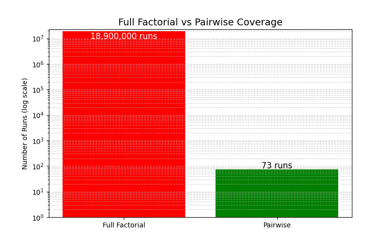
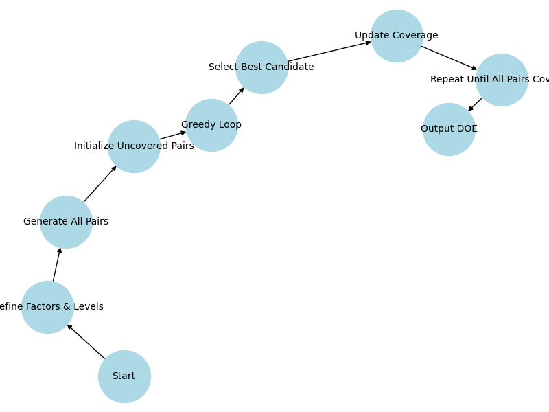

# Pairwise Design of Experiments (DOE): Complete Guide

A comprehensive guide to t-way covering arrays, the algorithms implemented in DOEAnalysis, and practical usage instructions.

---

## Table of Contents

1. [Introduction](#1-introduction)
2. [Pairwise Coverage Concept](#2-pairwise-coverage-concept)
3. [Mathematical Basis](#3-mathematical-basis)
4. [Algorithms](#4-algorithms)
5. [Quick Start](#5-quick-start)
6. [Configuration Reference](#6-configuration-reference)
7. [Constraints](#7-constraints)
8. [Seed Rows](#8-seed-rows)
9. [Coverage Analysis & Visualization](#9-coverage-analysis--visualization)
10. [Practical Tips](#10-practical-tips)
11. [References](#11-references)

---

## 1. Introduction

Design of Experiments (DOE) systematically explores factor effects. A **full factorial design** tests every combination:

$$N_{\text{full}} = \prod_{i=1}^k L_i$$

For a system with 12 factors and varying levels:

$$k = 12, \quad L = [5,5,5,5,4,2,2,3,2,5,7,9]$$

$$N_{\text{full}} = 18{,}900{,}000 \text{ runs}$$

This is often impractical. **Pairwise (2-way) DOE** dramatically reduces run count while ensuring coverage of all factor-level pairs.



---

## 2. Pairwise Coverage Concept

Instead of testing all combinations, pairwise DOE ensures every *pair* of factor levels appears at least once. This constructs a **2-way covering array**, denoted CA(N; t=2, k, v).

**Key quantities:**

| Metric | Formula | Example Value |
|--------|---------|---------------|
| Number of factors | k | 12 |
| Pairs per row | C(k,2) | 66 |
| Total level-level pairs | Σᵢ<ⱼ Lᵢ × Lⱼ | 1,312 |
| Theoretical minimum rows | ⌈total_pairs / pairs_per_row⌉ | ~20 |
| Practical greedy result | — | ~73 rows |

**Reduction factor:** 18,900,000 / 73 ≈ **258,000×** fewer runs!


### Why Pairwise Works

Research shows that most software defects are triggered by interactions between 1-2 parameters. Pairwise testing catches these interaction bugs while keeping test count manageable.

---

## 3. Mathematical Basis

For each pair of factors $(F_i, F_j)$:

$$\text{Pairs}_{i,j} = L_i \times L_j$$

Total pairs to cover across all unique factor pairs:

$$\sum_{i<j} L_i \cdot L_j$$

The **theoretical lower bound** for the number of rows is:

$$ N_{ \min } = \left\lceil \frac{\sum_{i<j} L_i \cdot L_j}{C(k,2)} \right\rceil $$

In practice, algorithms produce designs larger than this bound due to overlap constraints and the greedy nature of construction.

---

## 4. Algorithms

DOEAnalysis implements three algorithms in `pairwise_improvements.py`:



### 4.1 IPOG (In-Parameter-Order General)

**How it works:**
1. Start with full factorial of first t factors
2. For each additional factor, extend existing rows by choosing the level that covers the most uncovered tuples
3. Add new rows for any remaining uncovered tuples

**Characteristics:**
- Systematic, deterministic construction
- Generally produces compact designs
- Good default choice for most problems

```toml
[settings]
algorithm = "ipog"
```

### 4.2 Greedy

**How it works:**
1. Initialize set of all required t-tuples
2. Randomly sample K candidate rows
3. Select candidate covering the most uncovered tuples
4. Repeat until all tuples covered

**Characteristics:**
- Simple and fast
- Results vary with random seed
- May produce larger designs than IPOG

```toml
[settings]
algorithm = "greedy"
seed = 42  # For reproducibility
```

### 4.3 Hybrid

**How it works:**
1. Run IPOG for initial construction
2. If coverage incomplete, run greedy to fill gaps
3. Apply simulated annealing to try removing redundant rows
4. Post-process pruning to eliminate unnecessary rows

**Characteristics:**
- Best for minimizing row count
- Slower than IPOG or greedy alone
- Recommended when design size is critical

```toml
[settings]
algorithm = "hybrid"
prune = true
```

### Algorithm Comparison

| Algorithm | Speed | Compactness | Deterministic | Best For |
|-----------|-------|-------------|---------------|----------|
| `ipog` | Fast | Good | Yes | Most use cases |
| `greedy` | Medium | Variable | No (seeded) | Simple problems |
| `hybrid` | Slower | Best | Partially | Minimizing test count |

---

## 5. Quick Start

### Step 1: Create Configuration

Create `doe_config.toml`:

```toml
[factors]
"Browser" = ["Chrome", "Firefox", "Safari", "Edge"]
"OS" = ["Windows", "macOS", "Linux"]
"Resolution" = ["1080p", "1440p", "4K"]

[settings]
algorithm = "hybrid"
t = 2
out = "test_matrix.csv"
prune = true
seed = 42
```

### Step 2: Generate DOE

```bash
python generate_doe.py --config doe_config.toml
```

### Step 3: Review Output

The tool writes `test_matrix.csv` with your covering array.

### Step 4: Analyze Coverage (Optional)

```bash
python plot_coverage.py test_matrix.csv --config doe_config.toml --t 2 --outdir ./plots
```

---

## 6. Configuration Reference

### `[settings]` Options

| Key | Type | Default | Description |
|-----|------|---------|-------------|
| `algorithm` | string | `"ipog"` | `ipog`, `greedy`, or `hybrid` |
| `t` | int | `2` | t-way coverage (2=pairwise, 3=3-way, etc.) |
| `out` | string | `"Pairwise_DOE.csv"` | Output CSV path |
| `prune` | bool | `true` | Remove redundant rows after generation |
| `prune_infeasible` | bool | `true` | Skip infeasible t-tuples during generation |
| `seed` | int | `42` | Random seed for reproducibility |
| `plots` | bool | `false` | Generate coverage plots |
| `statistics` | bool | `false` | Generate statistics summary |
| `report` | bool | `false` | Generate Markdown coverage report |
| `max_pair_heatmaps` | int | `16` | Limit per-pair heatmaps generated |
| `constraints` | string | — | Path to Python constraints file |
| `seed_rows` | list | — | Pre-specified rows to include |

### `[factors]` Section

Define factors and their levels:

```toml
[factors]
"Input Rate" = [32000, 34000, 36000, 38000, 40000]
"Temperature" = [100, 120, 140, 160]
"Mode" = ["Auto", "Manual", "Eco"]
```

**Supported level types:** integers, floats, strings, booleans

---

## 7. Constraints

Constraints filter out infeasible factor combinations.

### Option 1: Inline TOML Constraints

```toml
[[constraints]]
if = { "Tank Volume" = "36g" }
then_not = { "Water Outlet" = 125 }

[[constraints]]
if = { "Jacket Thickness" = 2, "Water Outlet" = 125 }
then_not = { "Damper" = "Top" }
```

### Option 2: Python Constraint File

Create `constraints.py`:

```python
def is_valid(row):
    """Return True if row is valid, False otherwise.
    
    Args:
        row: List of values in factor order (same as [factors] keys)
    """
    input_rate, gas_valve, fan_speed, temp = row
    
    # High fan speed not allowed with low input rate
    if fan_speed == "High" and input_rate == 32000:
        return False
    
    # Temperature must be >= 120 when gas valve > 4
    if gas_valve > 4 and temp < 120:
        return False
    
    return True
```

Reference in config:

```toml
[settings]
constraints = "constraints.py"
```

### Constraint Behavior

- Invalid rows are rejected during candidate sampling
- Infeasible t-tuples can be pre-eliminated (`prune_infeasible = true`)
- The algorithm attempts random fills to find valid configurations

---

## 8. Seed Rows

Pre-specify test cases that **must** appear in the final design.

### Inline in TOML

```toml
[settings]
seed_rows = [
    [32000, 0, 3, 1, 115, 64],
    [40000, 22, 4, 2, 125, 70]
]
```

**Important:** Each seed row must have exactly as many values as there are factors, in the same order as `[factors]` keys.

### From JSON File

Create `seed_rows.json`:

```json
[
    [32000, 0, 3, 1, 115, 64],
    [40000, 22, 4, 2, 125, 70]
]
```

Reference in config:

```toml
[settings]
seed_rows = "seed_rows.json"
```

### Use Cases for Seed Rows

- Baseline/reference configurations
- Known critical test cases
- Regression test preservation
- Customer-specific configurations

---

## 9. Coverage Analysis & Visualization

### Running Coverage Analysis

```bash
python plot_coverage.py <csv_file> --config <config.toml> --t 2 --outdir ./plots
```

### CLI Options

| Option | Description |
|--------|-------------|
| `csv` | Input CSV with DOE design |
| `--config` | TOML config for factor ordering |
| `--t` | t-way coverage level |
| `--outdir` | Output directory for plots |
| `--report` | Generate Markdown report |
| `--stats-only` | Statistics without plots |
| `--max-pair-heatmaps` | Limit heatmap count |
| `--show` | Display plots interactively |

### Generated Outputs

| File | Description |
|------|-------------|
| `coverage_progress.png` | Coverage % vs cumulative rows |
| `coverage_gain_per_row.png` | New tuples covered per row |
| `pair_freq_hist.png` | Histogram of pair frequencies |
| `coverage_fraction_pie.png` | Covered vs missing tuples |
| `pair_coverage_matrix.png` | Heatmap of coverage % per factor pair |
| `heatmap_*.png` | Per-pair level×level counts |
| `coverage_summary.txt` | Text statistics summary |
| `coverage_report.md` | Full Markdown report |

### Example: Generate Full Report

```toml
[settings]
algorithm = "hybrid"
t = 2
out = "Pairwise_DOE.csv"
plots = true
report = true
```

```bash
python generate_doe.py --config doe_config.toml
# Creates Pairwise_DOE.csv and Pairwise_DOE.csv.plots/ directory
```

---

## 10. Practical Tips

### Choosing t (Coverage Strength)

| t | Coverage | Typical Use Case | Row Growth |
|---|----------|------------------|------------|
| 2 | Pairwise | Most software testing | Moderate |
| 3 | 3-way | Safety-critical systems | Significant |
| 4+ | Higher-order | Rare, specialized | Exponential |

**Recommendation:** Start with t=2. Only increase if you have evidence of higher-order interactions.

### Reproducibility

Always set a random seed:

```toml
[settings]
seed = 42
```

### Performance Tuning

- **Large factor spaces:** Use `algorithm = "ipog"` for faster generation
- **Minimize rows:** Use `algorithm = "hybrid"` with `prune = true`
- **Many constraints:** Set `prune_infeasible = true` to skip impossible tuples early

### Validation

Always verify coverage after generation:

```python
from pairwise_improvements import validate_coverage_rows, indices_from_factors
import pandas as pd

df = pd.read_csv('Pairwise_DOE.csv')
# ... load factors from config ...
names, levels = indices_from_factors(factors)
rows = df.values.tolist()
is_complete, missing = validate_coverage_rows(rows, levels, t=2)
print(f"Coverage complete: {is_complete}, Missing: {len(missing)} tuples")
```

### Common Pitfalls

1. **Diminishing returns:** First 60-90% of pairs cover quickly; last 10% takes many rows
2. **Over-constraining:** Too many constraints can make coverage impossible
3. **Factor order:** Seed rows must match `[factors]` key order exactly
4. **t > 2 explosion:** Runtime and row count grow rapidly with t

---

## 11. References

- **IPOG Algorithm:** [NIST Publication on IPOG](https://csrc.nist.gov/publications/detail/journal-article/2008/ipog-a-general-strategy-for-t-way-software-testing)
- **Pairwise Testing:** [pairwise.org](https://www.pairwise.org/)
- **Covering Arrays:** [NIST Covering Array Resources](https://math.nist.gov/coveringarrays/)
- **ACTS Tool:** [NIST ACTS](https://csrc.nist.gov/projects/automated-combinatorial-testing-for-software)
- Kuhn et al. (2004), *Software Fault Interactions and Pairwise Testing*
- Montgomery, D.C. (2017), *Design and Analysis of Experiments*
